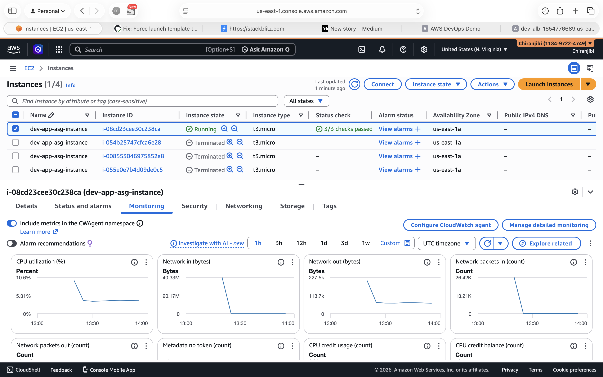

# AWS CI/CD Deployment Pipeline

**Live Demo:** http://dev-alb-1654776689.us-east-1.elb.amazonaws.com

A production-ready automated deployment pipeline demonstrating Infrastructure as Code, CI/CD automation, and AWS best practices.

## 🚀 What This Demonstrates

- **Infrastructure as Code**: Complete AWS infrastructure defined in Terraform with remote state (S3 + DynamoDB locking)
- **CI/CD Automation**: GitHub Actions pipeline with automated build, test, and deployment
- **Containerization**: Dockerized Node.js application deployed to AWS
- **High Availability**: Application Load Balancer with Auto Scaling across multiple AZs
- **Security Best practices**: Private subnets, IAM roles, SSM Session Manager (no SSH), IMDSv2 enforcement
- **Monitoring**: CloudWatch alarms with automatic scaling policies
- **Cost Optimization**: Single-AZ NAT, minimal instance count, automated resource cleanup

## 📸 Screenshots




[View all screenshots →](screenshots/)

## 🏗️ Architecture
```
GitHub Actions (CI/CD)
    ↓
Terraform (Infrastructure as Code)
    ↓
AWS Infrastructure:
    ├─ VPC (10.0.0.0/16)
    │  ├─ Public Subnets (2 AZs)
    │  │  └─ Application Load Balancer
    │  └─ Private Subnets (2 AZs)
    │     └─ Auto Scaling Group (1-4 instances)
    ├─ ECR (Container Registry)
    ├─ CloudWatch (Monitoring & Alarms)
    └─ IAM Roles (Secure access)
```

## 🛠️ Tech Stack

- **Cloud**: AWS (VPC, EC2, ALB, Auto Scaling, ECR, CloudWatch, IAM)
- **Infrastructure as Code**: Terraform (remote state with S3 + DynamoDB)
- **CI/CD**: GitHub Actions (automated testing and deployment)
- **Container**: Docker
- **Application**: Node.js + Express
- **Monitoring**: CloudWatch with auto-scaling policies

## 🔑 Key Features

### Infrastructure as Code
- Terraform with remote state in S3 (encrypted, versioned)
- DynamoDB state locking prevents concurrent modifications
- Modular, reusable infrastructure code

### Automated CI/CD Pipeline
1. **Build & Test**: Docker image built and tested
2. **Deploy Infrastructure**: Terraform creates/updates AWS resources
3. **Push Image**: Docker image pushed to ECR
4. **Instance Refresh**: Rolling update to pull new image

### Security
- ✅ No SSH access - using AWS Systems Manager Session Manager
- ✅ Private subnets for compute resources
- ✅ IAM roles (no hardcoded credentials)
- ✅ IMDSv2 enforced on EC2 instances
- ✅ Security groups with least privilege
- ✅ Encrypted EBS volumes and container images

### High Availability & Scalability
- Multi-AZ deployment
- Application Load Balancer with health checks
- Auto Scaling: 1-4 instances based on CPU utilization
- Automatic instance replacement on failure

### Cost Optimization
- Single NAT Gateway for dev environment
- t3.micro instances (Free Tier eligible)
- ECR lifecycle policy (keeps only last 3 images)
- Auto-scaling reduces costs during low traffic

## 📊 Monitoring

**CloudWatch Alarms:**
- High CPU (>80%) → Scale up
- Low CPU (<20%) → Scale down
- Unhealthy targets → Alert
- Billing alert at $50

## 🚀 How It Works

### Deployment Flow
```
1. Push code to GitHub main branch
   ↓
2. GitHub Actions triggers
   ↓
3. Build & test Docker image
   ↓
4. Terraform deploys infrastructure (VPC, ALB, ASG, ECR)
   ↓
5. Push Docker image to ECR
   ↓
6. Trigger instance refresh
   ↓
7. New instances pull latest image
   ↓
8. Health checks pass → Live!
```

### First Deployment
- Creates: VPC, subnets, NAT gateway, ALB, target groups, security groups, IAM roles, ECR, CloudWatch alarms
- Launches: Auto Scaling Group with instances in private subnets
- Total time: ~10-12 minutes

### Subsequent Updates
- Only updates changed resources
- Rolling instance refresh (zero downtime)
- Total time: ~5-7 minutes

## 💰 Monthly Cost Estimate

**Development Environment:**
- EC2 (1× t3.micro): ~$8
- NAT Gateway: ~$32
- ALB: ~$22
- EBS volumes: ~$2
- Data transfer: ~$5
- **Total: ~$69/month**

*(Free Tier covers most costs for first 12 months)*

## 📁 Project Structure
```
aws-cicd-pipeline/
├── app/                    # Node.js application
│   ├── app.js             # Express server
│   ├── package.json       # Dependencies
│   └── Dockerfile         # Container definition
├── terraform/             # Infrastructure as Code
│   ├── backend.tf         # S3 + DynamoDB state
│   ├── vpc.tf            # Networking
│   ├── security.tf       # Security groups
│   ├── iam.tf            # IAM roles
│   ├── compute.tf        # ALB, ASG, Launch Template
│   ├── monitoring.tf     # CloudWatch alarms
│   ├── variables.tf      # Input variables
│   ├── outputs.tf        # Output values
│   └── user_data.sh      # Instance bootstrap script
├── .github/workflows/
│   └── deploy.yml        # CI/CD pipeline
└── screenshots/          # Infrastructure screenshots
```

## 🎯 What I Learned

- Implementing Infrastructure as Code with Terraform
- Building automated CI/CD pipelines with GitHub Actions
- AWS networking (VPC, subnets, routing, NAT)
- Container orchestration with Docker and ECR
- Auto Scaling and load balancing strategies
- CloudWatch monitoring and alerting
- Security best practices (IAM, security groups, SSM)
- Cost optimization techniques

## 🔄 Future Enhancements

- [ ] HTTPS with ACM certificate
- [ ] CloudFront CDN for static assets
- [ ] RDS database integration
- [ ] ECS/Fargate for container orchestration
- [ ] Blue-green deployment strategy
- [ ] Prometheus + Grafana for advanced monitoring
- [ ] Multi-environment setup (dev/staging/prod)

## 👤 Author

**Chiranjibi Dewangan**
- LinkedIn: [linkedin.com/in/chiranjibi-dewangan](https://www.linkedin.com/in/chiranjibi-dewangan)
- GitHub: [github.com/Chiranjibi-Dewangan](https://github.com/Chiranjibi-Dewangan)
- Email: chiranjibi36@gmail.com

## 📝 License

This project is open source and available under the MIT License.
